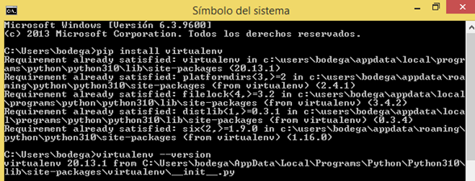
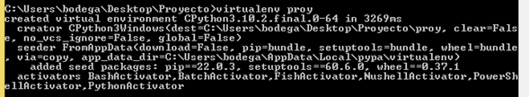
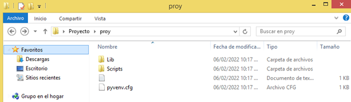
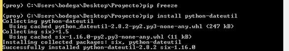
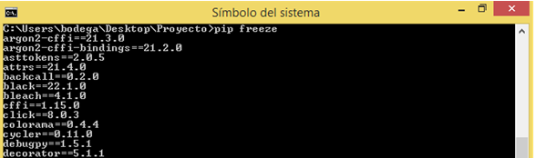

### 1. 	Se instala ***pip install virtualenv*** en el símbolo de sistema y la manera de comprobar la versión con el comando ***virtualenv --version***

### 2.	Se redirecciona hacia un directorio.

### 3.    Se coloca el comando para crear el entorno virtual ***virtualenv proy*** (proy es como se va a llamar la carpeta donde estará el entorno virtual).

### 4.    Para activar el entorno virtual colocamos nos dirigimos a ***\proy\Scripts\activate***

### 5.    Una vez activado aparecerá en el lado izquierdo  **(proy)** , el nombre del entorno virtual en paréntesis.

### 6.  Para ver los paquetes que están instalados en el entorno virtual se coloca el comando ***pip freeze***

### 7. Se instala el paquete **python-dateutil** con el comando ***pip install***

### 8.    Al volver a colocar el comando nos muestra estos paquetes instalados.

### 9.    Para desactivar el entorno virtual colocamos ***deactivate***

### 10.	Al desactivarlo ya no aparecerá **(proy)** y al colocar el comando ***pip freeze*** se mostrarán un montón de paquetes instalados en la máquina en vez de los que están en el entorno virtual

